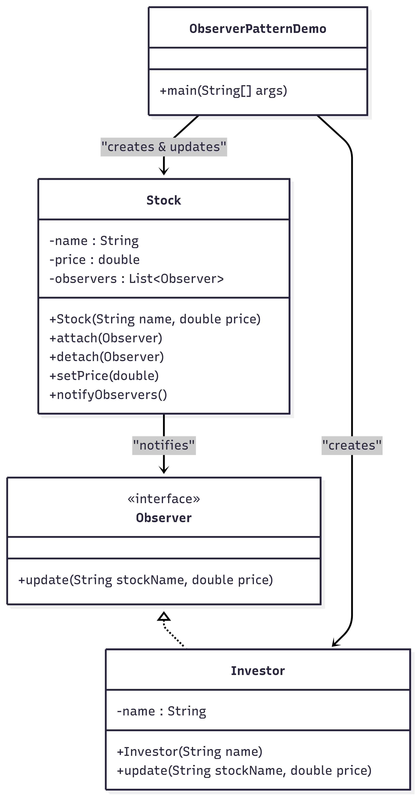

# 📈 Stock Market Notifier (Observer Pattern)

## Overview

This project demonstrates the implementation of the **Observer Design Pattern** in Java. The pattern establishes a one-to-many relationship where a **Subject** (the Stock) notifies multiple **Observers** (the Investors) when its state changes.

---

## 🚀 Key Components and Design

### Design Pattern: Observer (Behavioral)

The Observer Pattern is used here to achieve **decoupling** between the stock and the investors. The `Stock` object doesn't need to know the concrete class of the investor; it only interacts with the generic `Observer` interface.

This application simulates a real-time stock price feed where investors subscribe to stock updates.

---

## Class Diagram



## 🛠️ How It Works

1.  **Subscription:** An Investor (e.g., `alice`) is registered with the Stock using `stock.register(alice)`. The Investor is added to the Stock's internal list of observers.
2.  **State Change:** The Stock's state is modified by calling a method like `stock.changePrice(newPrice)`.
3.  **Notification:** The `changePrice()` method internally calls a notification function (e.g., `notifyAllObservers()`).
4.  **Update:** The notification function iterates through the list of registered observers and calls the `onPriceUpdate()` method on each one, passing the new stock price.
5.  **Observer Action:** Each Investor's `onPriceUpdate()` method executes, printing a personalized notification to the console.

---

## 📦 Quick Start

The application is purely console-based. To run the demo, execute the `ObserverPatternDemo` class.

### Entry Point: `ObserverPatternDemo.java`

```java
public class ObserverPatternDemo {
    public static void main(String[] args) {
        Stock stock = new Stock(); // Subject

        Investor alice = new Investor("Alice"); // Observer 1
        Investor bob = new Investor("Bob");     // Observer 2

        stock.register(alice);
        stock.register(bob);

        stock.changePrice(100.0f); // Triggers Notification
        stock.changePrice(105.5f); // Triggers another Notification
    }
}
```

## Expected Output

After compilation and running ObserverPatternDemo, the following output demonstrates the investors being instantly notified of the stock price changes:

> > Alice notified: Stock price changed to 100.0
> > Bob notified: Stock price changed to 100.0
> > Alice notified: Stock price changed to 105.5
> > Bob notified: Stock price changed to 105.5
