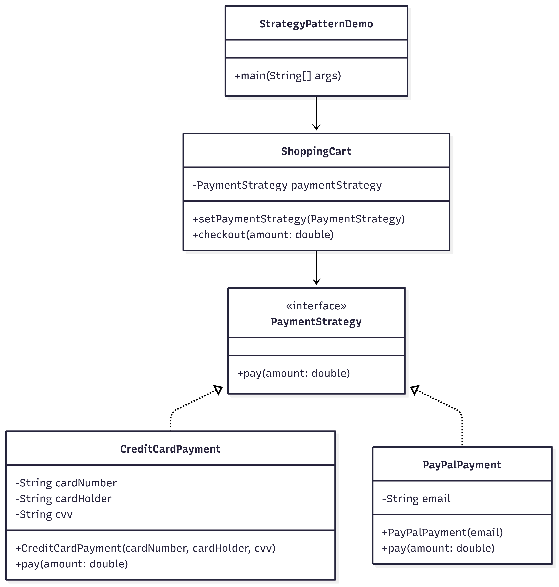

# Payment Application

## Overview

A console-based Java application that demonstrates the Strategy Design Pattern.
It allows users to select different payment methods (Credit Card or PayPal) at runtime and process payments accordingly.

## Features

**Payment Strategies**: Implements multiple strategies (CreditCardPayment, PayPalPayment) via a common PaymentStrategy interface.

**Dynamic Selection**: Users can choose a payment method at runtime.

**Encapsulation**: Payment logic is encapsulated in separate strategy classes.

**Extensibility**: New payment methods can be added without modifying existing code.

## Architecture

### File Structure

payment-method/
│
├── StrategyPatternDemo.java # Entry point (menu-driven console app)
├── ShoppingCart.java # Context class that uses a payment strategy
├── PaymentStrategy.java # Strategy interface
├── CreditCardPayment.java # Concrete strategy (Credit Card)
├── PayPalPayment.java # Concrete strategy (PayPal)
└── README.md # Project documentation

## Class Diagram

## Flow from StrategyPatternDemo.java

Menu Options:

Pay using Credit Card

Pay using PayPal

Exit

Payment Flow:

User selects a payment method.

Program asks for details (card info or PayPal email).

Corresponding strategy (CreditCardPayment or PayPalPayment) is executed.

Payment confirmation is displayed.

Exit:

Option 3 terminates the program.

Example Run
Welcome to Shopping Cart Payment Application!

Menu:

1. Pay using Credit Card
2. Pay using PayPal
3. Exit
   Enter your choice: 1

Enter card number: 1234-5678-9876-5432
Enter card holder name: John Doe
Enter CVV: 123

--- Payment Successful ---
Paid using Credit Card.

Another example:

Menu:

1. Pay using Credit Card
2. Pay using PayPal
3. Exit
   Enter your choice: 2

Enter PayPal email: user@example.com

--- Payment Successful ---
Paid using PayPal.

Exiting:

Menu:

1. Pay using Credit Card
2. Pay using PayPal
3. Exit
   Enter your choice: 3
   Exiting application. Goodbye!

## Code Quality

**Encapsulation**: Payment logic is separated from business logic.

**Design Pattern**: Correct Strategy Pattern implementation with interchangeable algorithms.

**Scalability**: New payment types (e.g., UPI, Crypto) can be added easily by creating new strategy classes.
