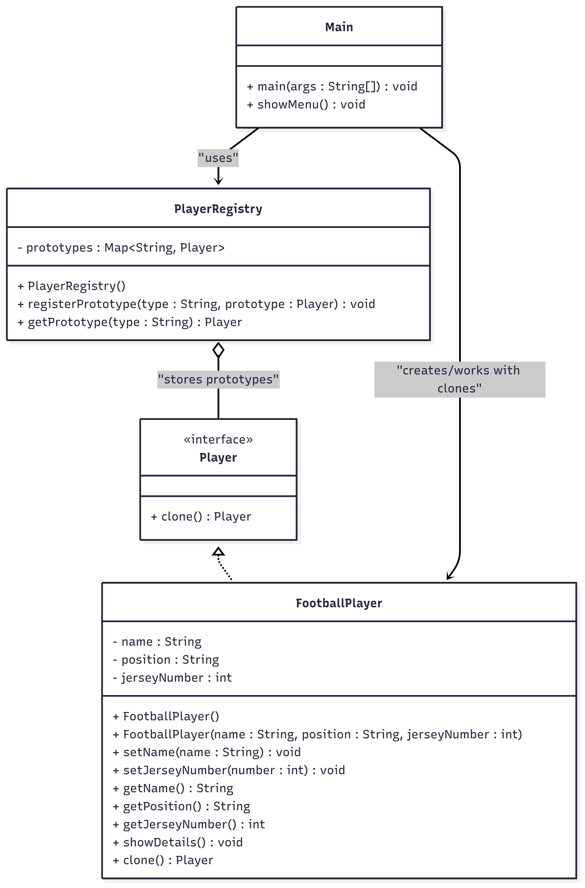

# ⚽ Football Club Application

## 📋 Overview

A console-based Java application that demonstrates the Prototype Design Pattern.
It allows cloning football player prototypes (Striker, Goalkeeper), customizing them (name, jersey number), and displaying their details.

## 🚀 Features

Prototypes: Default Striker and Goalkeeper stored in a PlayerRegistry.

Clone Players: Users can choose a prototype and create a new player by cloning.

Customization: Each cloned player can have a new name and jersey number.

Player Info: Displays the player’s details after creation.

## 🏗️ Architecture

File Structure
football-club/
│
├── Main.java # Entry point (menu-driven console app)
├── Player.java # Prototype interface (defines clone method)
├── FootballPlayer.java # Concrete class implementing Player (clonable entity)
├── PlayerRegistry.java # Stores prototypes and provides cloning
└── README.md # Project documentation

## Class Diagram

## 📊 Flow from Main.java

### Default Prototypes Created:

Striker → "Default Striker", Jersey 9

Goalkeeper → "Default Keeper", Jersey 1

### Menu Options:

Menu:

1. Clone a Striker
2. Clone a Goalkeeper
3. Exit

### Player Creation:

User selects prototype.

Program clones the prototype.

User enters name and jersey number.

Player details are displayed.

### Exit:

Option 3 ends the program.

## 🎮 Example Run

Welcome to Football Club Application!

Menu:

1. Clone a Striker
2. Clone a Goalkeeper
3. Exit
   Enter your choice: 1

Enter player name: Ronaldo
Enter jersey number: 7

--- Player Details ---
Name: Ronaldo
Position: Striker
Jersey Number: 7

Another example:

Menu:

1. Clone a Striker
2. Clone a Goalkeeper
3. Exit
   Enter your choice: 2

Enter player name: Neuer
Enter jersey number: 1

--- Player Details ---
Name: Neuer
Position: Goalkeeper
Jersey Number: 1

Exiting:

Menu:

1. Clone a Striker
2. Clone a Goalkeeper
3. Exit
   Enter your choice: 3
   Exiting application. Goodbye!

## 📈 Code Quality

Encapsulation: Clear roles between prototype interface, player class, registry, and main client.

Design Pattern: Correct Prototype Pattern with cloning implemented.

Scalability: New roles (Defender, Midfielder, etc.) can be added easily.
