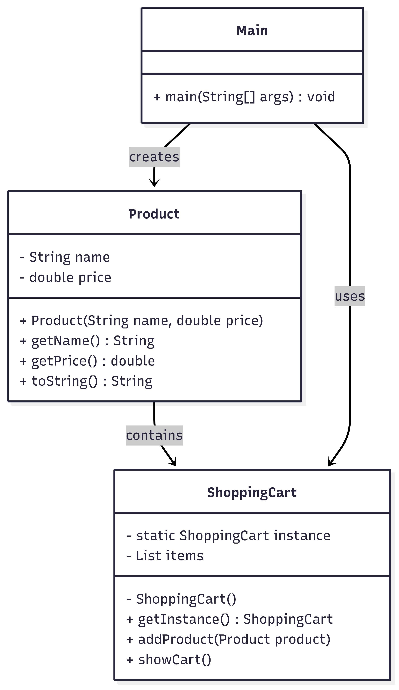

# 🛒 Shopping Cart Application (Singleton Pattern)

## 📋 Overview

This is a simple, console-based Java application for managing a shopping cart.

The primary goal of this project is to demonstrate the **Singleton Design Pattern** by ensuring that only one instance of the `ShoppingCart` exists throughout the program, regardless of how many times it is accessed.

---

## 🚀 Features

### Core Functionality

- **Add Products:** Allows the user to input a product name and price from the console and add it to the cart.
- **View Cart:** Displays all items currently contained in the cart, along with their price.
- **Exit:** Terminates the application gracefully.

### Design Pattern: Singleton (Creational)

The `ShoppingCart` class implements the Singleton pattern, ensuring a globally accessible, single instance of the cart is used everywhere in the application.

---

## 🏗️ Architecture

### File Structure

shopping-cart/
│
├── Main.java # Entry point (menu-driven console app)
├── ShoppingCart.java # Singleton class (cart management)
├── Product.java # Product model class
└── README.md # Project documentation

## Class Diagram

### Class Responsibilities

- **`Main.java`**: Handles all user interaction via the console menu and drives the application flow.
- **`ShoppingCart.java`**: The **Singleton** class. It holds the collection of items and provides methods (`addItem`, `viewCart`) to manage them.
- **`Product.java`**: A simple model that represents a product entity, containing a `name` and a `price`.

---

## 📦 Quick Start

### 1. Clone Repository

git clone https://github.com/Harish7113/shopping-cart.git
cd shopping-cart

### 2. Compile

javac Main.java ShoppingCart.java Product.java

### 3. Run

java Main

## 🎮 Usage

Main Menu Options
MAIN MENU

---

1. Add Product
2. View Cart
3. Exit

## Example Usage

### Adding a Product:

Enter product name: Laptop
Enter product price: 75000
✓ Laptop added to cart.

### Viewing Cart:

🛒 Your Cart:

- Laptop ($75000.0)
- Smartphone ($30000.0)

### Exiting:

Thank you for shopping!

## 📈 Code Quality

Encapsulation: Clear separation between model (Product), singleton (ShoppingCart), and UI (Main).

Design Pattern: Proper Singleton implementation with a private constructor and global access method.

Scalability: Easy to extend with remove/edit features.

Input Handling: Menu-driven user interaction.
