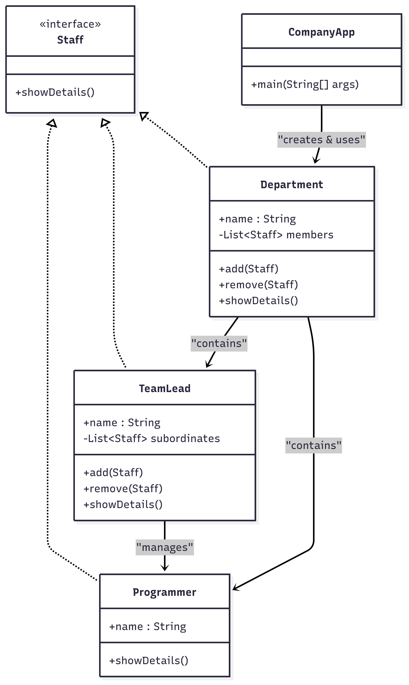

# 🏢 Company Composite Application
## 📋 Overview

A console-based Java application that demonstrates the Composite Design Pattern.
It models a company hierarchy where departments, team leads, and programmers form a tree-like structure, making it easy to treat individual employees and groups of employees uniformly.

## 🚀 Features

**Hierarchical Structure**: Models departments, team leads, and programmers.

**Composite Pattern**: Departments and team leads can contain other staff.

**Uniform Treatment**: Both single employees (leaf nodes) and groups (composites) can be processed using the same interface.

**Company Display**: Prints a structured view of the company hierarchy.

## 🏗️ Architecture
### File Structure
composite_pattern/
│
├── CompanyApp.java   # Entry point (creates hierarchy, displays structure)
├── Staff.java        # Component interface
├── Programmer.java   # Leaf class (individual staff)
├── TeamLead.java     # Composite (can have multiple programmers)
├── Department.java   # Composite (can have team leads or programmers)
└── README.md         # Project documentation

## Class Diagram

## 📊 Flow from CompanyApp.java
### Steps:

Create staff members (Programmers).

Assign programmers under team leads.

Add team leads and individual staff into departments.

Display the full company hierarchy.

Example Structure:
Department: Development
  TeamLead: Alice
    Programmer: Bob
    Programmer: Charlie
  TeamLead: David
    Programmer: Eva

🎮 Example Run
--- Company Structure ---
Department: Development
 TeamLead: Alice
   Programmer: Bob
   Programmer: Charlie
 TeamLead: David
   Programmer: Eva

Department: HR
 TeamLead: Frank
   Programmer: Grace

## 📈 Code Quality

Encapsulation: Clear separation of responsibilities between staff, team leads, and departments.

Design Pattern: Correct implementation of the Composite Pattern, allowing recursive hierarchy creation.

Scalability: New roles or organizational structures can be added with minimal changes.