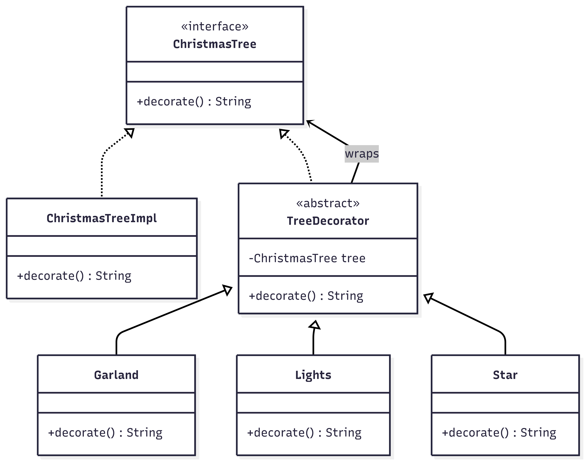

# Christmas Tree Decorator Application

## Overview

A simple, console-based Java application that demonstrates the Decorator Design Pattern using a Christmas tree example.
Users can decorate a tree with Garland, Lights, and Star dynamically at runtime.

## Features

### Core Functionality

Start with a plain Christmas tree.

Add multiple decorations (Garland, Lights, Star) based on user input.

Display the final decorated tree.

### Design Pattern

Decorator Pattern:

Allows behavior to be added to an object dynamically without altering its structure.

Each decoration (Garland, Lights, Star) wraps the tree and adds new functionality.

## Architecture

### File Structure

christmas-tree-decorator/
│
├── Main.java # Entry point (menu-driven console app)
├── ChristmasTree.java # Component interface
├── ChristmasTreeImpl.java # Concrete component (plain tree)
├── TreeDecorator.java # Abstract decorator
├── Garland.java # Concrete decorator (adds garland)
├── Lights.java # Concrete decorator (adds lights)
├── Star.java # Concrete decorator (adds star)
└── README.md # Project documentation

## Class Diagram

## Quick Start

### 1.Clone Repository

git clone https://github.com/Harish7113/ChristmasTree.git
cd ChristmasTree

### 2.Compile

javac \*.java

### 3.Run

java Main

## Usage

When you run the application, you will see:

Choose decorations to add to the Christmas Tree:

1. Garland
2. Lights
3. Star
4. Done

Example Interaction:

Enter choice: 1
Enter choice: 2
Enter choice: 3
Enter choice: 4

Final Tree Decoration: Christmas Tree with Garland with Lights with Star

## Code Quality

**Encapsulation**: Clear separation between component, decorators, and main logic.

**Extensibility**: Easy to add new decorations by extending TreeDecorator.

**User Driven**: Interactive input ensures flexible runtime decoration.
